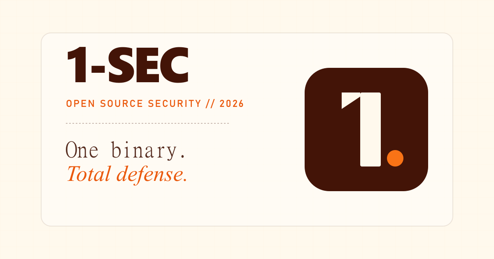

<div align="center">
  

  <h1>🛡️ 1-SEC</h1>
  <p><strong>One binary. Total defense.</strong></p>
  <p>16 security modules. Single binary. Zero config required.<br/>
  Covers AI attacks, prompt injection, ransomware, supply chain, deepfakes, quantum crypto, and more.</p>

  <p>
    <a href="https://github.com/cutmob/1-SEC/blob/main/LICENSE"></a>
    <a href="https://golang.org/"></a>
    <a href="https://github.com/cutmob/1-SEC/releases"></a>
  </p>

  <p>
    <a href="https://1-sec.dev">Website</a> ·
    <a href="https://1-sec.dev/docs">Docs</a> ·
    <a href="https://1-sec.dev/pricing">Pricing</a> ·
    <a href="https://1-sec.dev/dashboard">Dashboard</a>
  </p>
</div>

---

## What is 1-SEC?

1-SEC is an open-source (AGPLv3) all-in-one cybersecurity platform. Instead of running 10+ separate agents — WAF, IDS, log shipper, compliance scanner, LLM firewall — you run **one binary** that covers every attack surface through a shared NATS JetStream event bus.

- **Zero config by default** — secure out of the box, tune later
- **Single binary** — no containers, no JVM, no Python env required for core operation
- **Privacy first** — your data stays on your server; cloud features are opt-in
- **AI is additive** — all 16 modules work standalone; the AI analysis layer adds cross-module correlation on top

---

## Quick Start

```bash
# Install
curl -fsSL https://1-sec.dev/get | sh

# Run (all 16 modules, zero config)
1sec up
```

Build from source:

```bash
git clone https://github.com/cutmob/1-SEC.git
cd 1-SEC
go build -o 1sec ./cmd/1sec
./1sec up
```

Docker:

```bash
cd deploy/docker
docker compose up -d
docker compose logs -f
```

Kubernetes (Helm):

```bash
helm install 1sec ./deploy/helm \
  --set env.GEMINI_API_KEY=your_key_here
```

---

## 16 Defense Modules

| # | Module | What it covers | Tier |
|---|--------|---------------|------|
| 1 | **Network Guardian** | DDoS, rate limiting, IP reputation, geo-fencing, DNS tunneling, C2 beaconing, lateral movement (PtH, Kerberoasting, Golden Ticket, DCSync), port scan detection | 1 |
| 2 | **API Fortress** | BOLA detection, schema validation, shadow API discovery, per-endpoint rate limiting | 1 |
| 3 | **IoT & OT Shield** | Device fingerprinting, protocol anomaly (MQTT/CoAP/Modbus), firmware integrity, default credential detection | 1 |
| 4 | **Injection Shield** | SQLi, XSS, SSRF, command injection, template injection, NoSQL injection, path traversal — with evasion decoding | 2 |
| 5 | **Supply Chain Sentinel** | SBOM generation, package integrity, typosquatting (Levenshtein), dependency confusion, CI/CD hardening | 2 |
| 6 | **Ransomware Interceptor** | Encryption detection, canary files, exfiltration monitoring, wiper detection (MBR/GPT), shadow copy deletion, compound attack correlation | 2 |
| 7 | **Auth Fortress** | Brute force, credential stuffing, session hijack, impossible travel, MFA fatigue, OAuth consent phishing, password spray, stolen token detection | 3 |
| 8 | **Deepfake Shield** | Synthetic voice/video detection (DFT-based), AI phishing, domain homoglyph spoofing, BEC detection | 3 |
| 9 | **Identity Fabric Monitor** | Synthetic identity detection, privilege escalation, service account anomaly, bulk creation detection | 3 |
| 10 | **LLM Firewall** | 55+ prompt injection patterns, jailbreak detection (DAN, FlipAttack, many-shot, time bandit, etc.), output filtering, multi-turn tracking, tool-chain abuse. Zero LLM calls. | 4 |
| 11 | **AI Agent Containment** | Action sandboxing, tool-use monitoring, shadow AI detection, scope escalation, policy enforcement | 4 |
| 12 | **Data Poisoning Guard** | Training data integrity, RAG pipeline validation, adversarial input detection, model drift monitoring | 4 |
| 13 | **Quantum-Ready Crypto** | Crypto inventory, PQC migration readiness, TLS auditing, cert expiry, HNDL attack detection | 5 |
| 14 | **Runtime Watcher** | FIM, container escape, LOLBin detection (40+), memory injection (process hollowing, DLL injection), persistence mechanisms, UEFI/bootkit, fileless malware | 6 |
| 15 | **Cloud Posture Manager** | Config drift, misconfiguration (public buckets, open SGs, wildcard IAM), secrets sprawl | 6 |
| 16 | **AI Analysis Engine** | Two-tier Gemini pipeline: Flash Lite for triage, Flash for deep classification and cross-module correlation | X |

---

## CLI Reference

```
1sec up                          Start all enabled modules
1sec up --modules X,Y,Z          Start only specific modules
1sec up --config /path/cfg.yaml  Use a custom config file
1sec up --dry-run                Validate config without starting
1sec up --log-level debug        Override log level

1sec status                      Show running engine status
1sec status --json               JSON output

1sec alerts                      Fetch recent alerts
1sec alerts --severity CRITICAL  Filter by severity
1sec alerts --module llm_firewall Filter by module
1sec alerts --json --output f.json Save to file

1sec scan                        Submit payload via stdin
1sec scan --input file.json      Submit payload from file
1sec scan --module injection_shield --type sqli

1sec modules                     List all 16 modules
1sec modules --tier 4            Filter by tier
1sec modules --json

1sec config                      Show resolved config
1sec config --validate           Validate and exit
1sec config --json

1sec check                       Pre-flight diagnostics
1sec stop                        Gracefully stop instance

1sec docker up                   Start via Docker Compose
1sec docker down                 Stop containers
1sec docker logs                 Follow container logs
1sec docker status               Show container status
1sec docker build                Build image from source

1sec version                     Print version + build info
1sec help <command>              Detailed help for any command
```

---

## Configuration

Zero-config works out of the box. All settings have sane defaults. Override via `configs/default.yaml` or `--config`:

```yaml
server:
  host: "0.0.0.0"
  port: 1780

bus:
  embedded: true        # NATS JetStream runs inside the binary
  data_dir: "./data/nats"
  port: 4222

modules:
  injection_shield:
    enabled: true
  auth_fortress:
    enabled: true
    settings:
      max_failures_per_minute: 10
      lockout_duration_seconds: 300
  ai_analysis_engine:
    enabled: true
    settings:
      triage_model: "gemini-flash-lite-latest"
      deep_model: "gemini-flash-latest"
      # Keys read from env: GEMINI_API_KEY, GEMINI_API_KEY_2, ...
```

AI keys are read from environment variables — no key required for the 15 rule-based modules:

```bash
export GEMINI_API_KEY=your_key_here
1sec up
```

---

## Deployment

### Single Binary

```bash
curl -fsSL https://1-sec.dev/get | sh
1sec up
```

### Docker Compose

```bash
# Clone and start
git clone https://github.com/cutmob/1-SEC.git
cd 1-SEC/deploy/docker

# Set your Gemini key (optional — AI engine only)
echo "GEMINI_API_KEY=your_key" > .env

docker compose up -d
docker compose logs -f

# Check status
docker compose exec 1sec 1sec status
```

Or use the CLI shortcut from anywhere in the repo:

```bash
1sec docker up
1sec docker logs
1sec docker status
1sec docker down
```

### Kubernetes (Helm)

```bash
# Install with defaults
helm install 1sec ./deploy/helm

# Install with Gemini AI key
helm install 1sec ./deploy/helm \
  --set env.GEMINI_API_KEY=your_key_here

# Install with custom config
helm install 1sec ./deploy/helm \
  --set env.GEMINI_API_KEY=your_key_here \
  --set-string config="$(cat my-config.yaml)"

# Upgrade
helm upgrade 1sec ./deploy/helm --reuse-values

# Check status
kubectl exec deploy/1sec -- 1sec status
kubectl exec deploy/1sec -- 1sec check
```

The Helm chart includes:
- Deployment with liveness/readiness probes on `/api/v1/status`
- PersistentVolumeClaim for NATS JetStream data
- ConfigMap for config override
- Secret for API keys (or reference an existing secret via `existingSecret`)
- Optional Ingress for the REST API
- Non-root security context, read-only root filesystem

---

## Architecture

```
┌─────────────────────────────────────────────────┐
│                   1SEC CLI / API                 │
│                  REST :1780                      │
├─────────────────────────────────────────────────┤
│         NATS JetStream Event Bus :4222           │
│   sec.events.>  (7d retention, 1GB)              │
│   sec.alerts.>  (30d retention, 512MB)           │
├────┬────┬────┬────┬────┬────┬────┬────┬────┬────┤
│Net │API │IoT │Inj │SC  │Ran │Auth│DF  │...│CP  │
└────┴────┴────┴────┴────┴────┴────┴────┴────┴────┘
              │                    │
       ┌──────┴──────┐      ┌──────┴──────┐
       │ AI Engine   │      │  Dashboard  │
       │ Tier 1: Lite│      │  Next.js    │
       │ Tier 2: Flash│     │  1-sec.dev  │
       └─────────────┘      └─────────────┘
```

Each module implements a single Go interface:

```go
type Module interface {
    Name() string
    Description() string
    Start(ctx context.Context, bus *EventBus, pipeline *AlertPipeline, cfg *Config) error
    Stop() error
    HandleEvent(event *SecurityEvent) error
}
```

Adding a module = adding one import. No registration boilerplate.

---

## REST API

The engine exposes a REST API on port 1780:

| Method | Path | Description |
|--------|------|-------------|
| GET | `/health` | Health check |
| GET | `/api/v1/status` | Engine status, module list, alert count |
| GET | `/api/v1/modules` | All registered modules |
| GET | `/api/v1/alerts` | Recent alerts (`?limit=N&min_severity=HIGH`) |
| GET | `/api/v1/config` | Current resolved config |
| POST | `/api/v1/events` | Ingest an external SecurityEvent |
| POST | `/api/v1/shutdown` | Graceful shutdown |

Secure the API by setting `ONESEC_API_KEY` or `server.api_keys` in config.

---

## Cloud Dashboard & AI (Pro/Enterprise)

The open-source engine is complete and fully functional standalone. Pro and Enterprise add:

- **Cloud dashboard** — real-time threat visualization, analytics, module health
- **Managed AI** — no Gemini key to configure; quota included (50K/500K triage events, 5K/50K deep analysis per month)
- **Webhooks** — Slack, Discord, PagerDuty, or any HTTP endpoint
- **Key rotation** — rotate API keys from the dashboard with usage history preserved

Community users can bring their own Gemini key (`GEMINI_API_KEY`) for AI features at no charge from us.

See [1-sec.dev/pricing](https://1-sec.dev/pricing) for details.

---

## Project Structure

```
1sec/
├── cmd/1sec/main.go          # CLI entry point (up, status, alerts, scan, docker, ...)
├── internal/
│   ├── core/                 # Engine, event bus, config, alert pipeline
│   ├── modules/              # 16 defense modules (one package each)
│   ├── api/                  # REST API server
│   └── ingest/               # Syslog ingestion (RFC 5424/3164)
├── configs/
│   └── default.yaml          # Default config with all modules
├── deploy/
│   ├── docker/               # Dockerfile + docker-compose.yml
│   └── helm/                 # Helm chart for Kubernetes
└── web/                      # Next.js dashboard + landing page
```

---

## License

AGPLv3 — see [LICENSE](LICENSE).

The core engine and all 16 modules are free and open source, forever.
